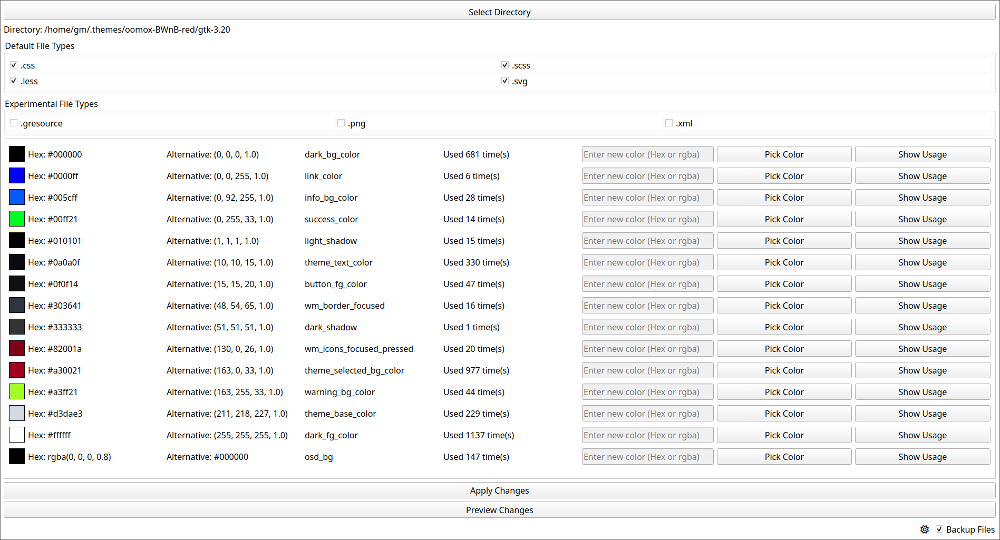

# Intro

Qt-based program to recursively extract, view, and modify the HEX, RGB, and/or RGBA colors used in files in a directory. Optionally create whole-directory backups. Simply clone the repo and run `python main.py`. Requires python-pyqt5. 

# UI Picture

